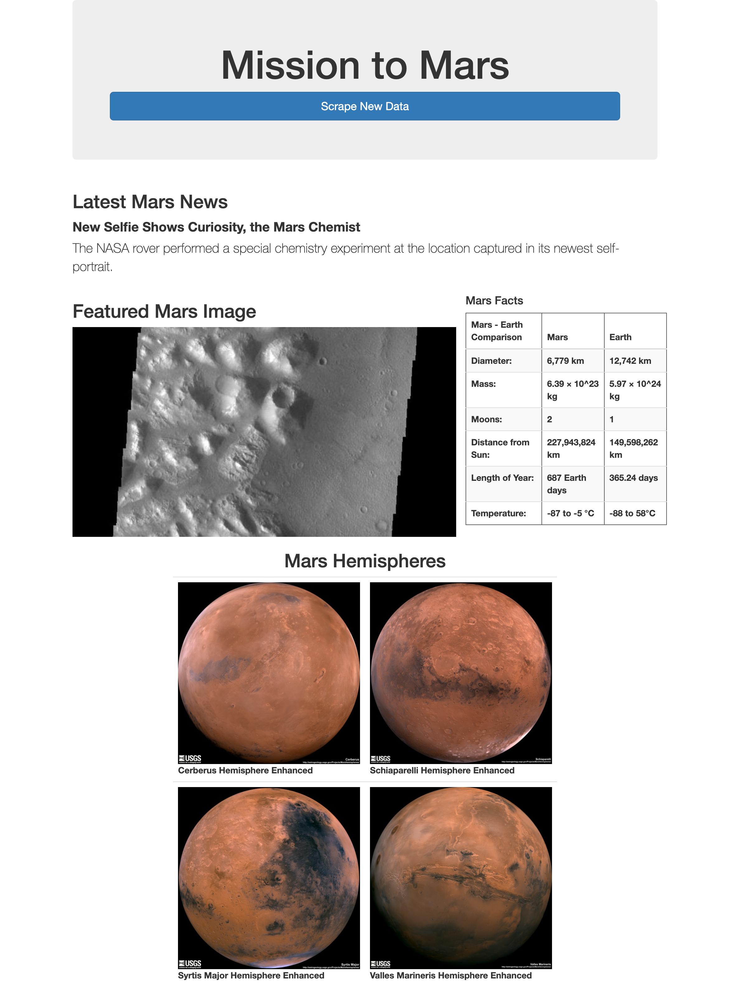
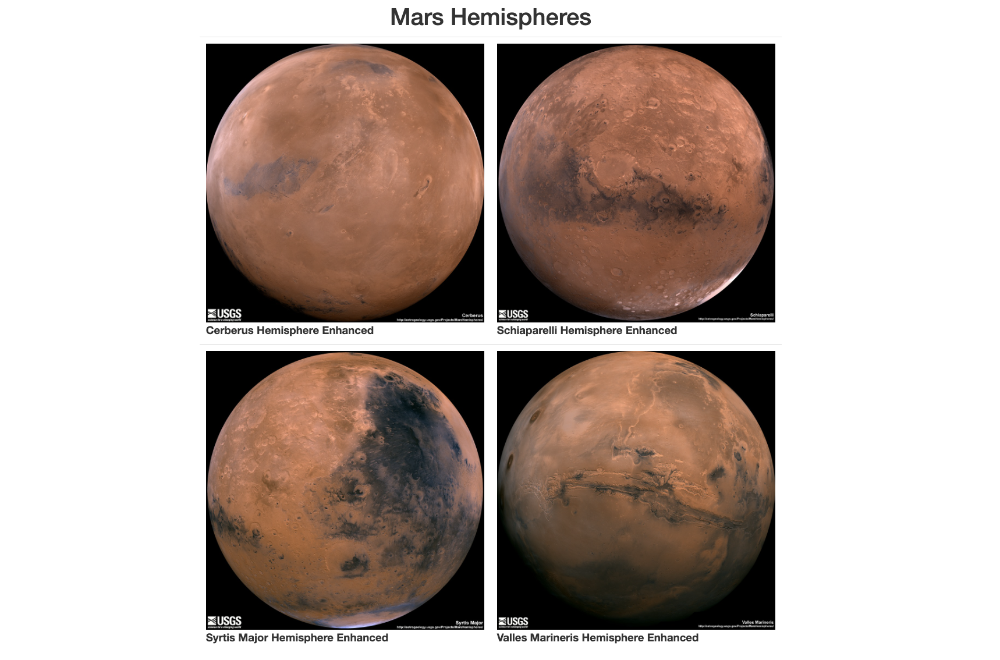
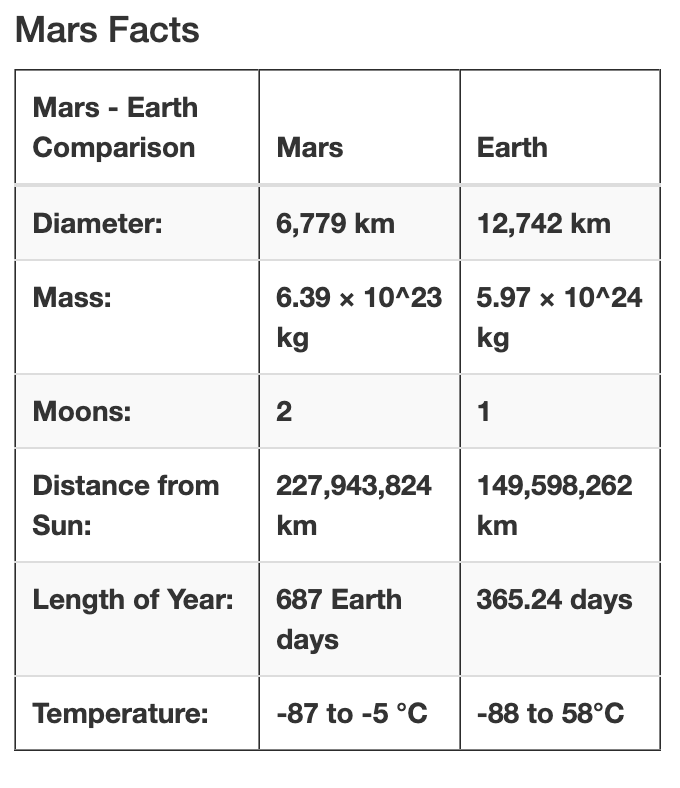
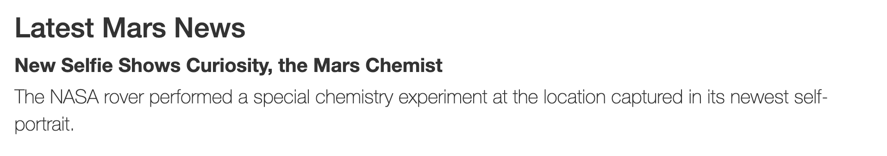

# Mission to Mars

## Overview of the Project

With lot of sites having information on Mars, this application was build to consolidate all the interesting information and images into a website. The application would allow the users to scrape new content from each of these siates to get the latest and greatest information.

## Resources
- Data Source: https://redplanetscience.com, https://spaceimages-mars.com, https://galaxyfacts-mars.com, https://marshemispheres.com
- Software: Python 3.9.7, Jupyter Notebook, flask, mongo, bootstrap, html
---

## Results

A new website was built using flask with the scrape option. The overall page looks as below:
||
| ------ |

### Application Flow

- The scrape button in turn runs the web scraping process in python using splinter and beautiful soup. 

- The collected data from the scraping process is stored into mongodb in the same process.

- The index html page is then rendered through flask collecting the data from mongo.

### Grids

The new components added were put also into grids. Added a new feature of using offset to get the required spacing.

    https://github.com/sanilveeravu/Mission-to-Mars-Challenge/blob/e2564dde6e8ffffc8bf320ca9d3081adca9dba51/templates/index.html#L50

    

### Additional Styling

1. The scrape button was added to span across the screen using btn-block.

    https://github.com/sanilveeravu/Mission-to-Mars-Challenge/blob/e2564dde6e8ffffc8bf320ca9d3081adca9dba51/templates/index.html#L17

    

2. The table was styled using bootstrap table class and various options. This was done as part of pandas to make it auto generated.

    https://github.com/sanilveeravu/Mission-to-Mars-Challenge/blob/e2564dde6e8ffffc8bf320ca9d3081adca9dba51/scraping.py#L111

    

3. The tile was updated to use lead.

    https://github.com/sanilveeravu/Mission-to-Mars-Challenge/blob/e2564dde6e8ffffc8bf320ca9d3081adca9dba51/templates/index.html#L29

    

---

## Summary

The application was able to collect all the necessary details about Mars and show an impressive effort even to NASA.

